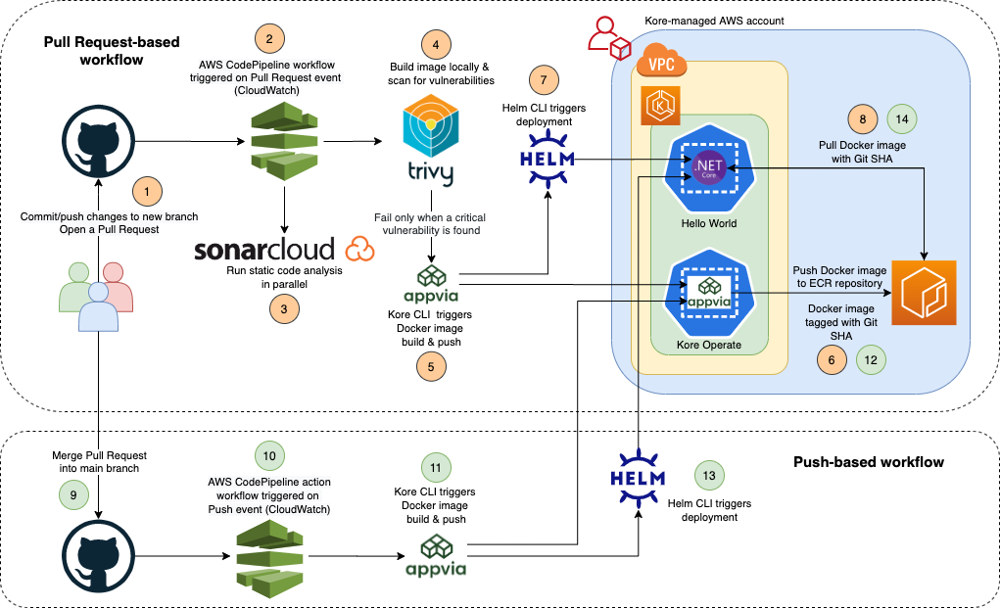

## CI with AWS CodePipeline, Kore and Helm

This repository demonstrates the use of AWS CodePipeline, Kore and Helm to achieve a simple continuous integration pipeline i.e. `../../../.github/workflows/dotnet-hello-world.yml`.

