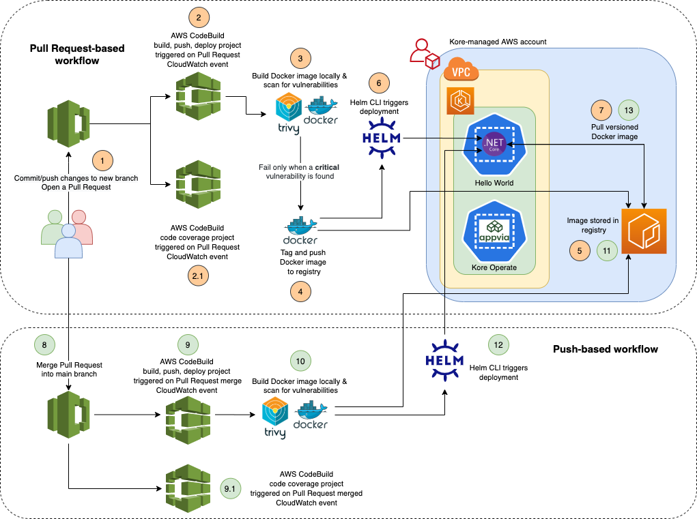

## CI with AWS services and Helm

This repository demonstrates the use of AWS services and Helm to achieve a simple continuous integration pipeline.

The CI workflow is triggered when a developer creates or merges an AWS CodeCommit pull request. This ensures that the code changes run through security and quality gates to provide a peer reviewer with the confidence and assurance to merge a pull request.

For demonstration purposes, code changes in a `pull request` or code changes merged into the `master` branch are eventually deployed in the same environment. However this can be customised according to your team's/organisation's branching and deployment strategy to extend to either perform a continuous delivery or continuous deployment to a Production environment.

## Prerequisites

The following scripts must be executed by an **AWS administrator** to ensure that a developer is granted least privileged permissions to complete the setup.

```bash
./scripts/grant-aws-access.sh -u <USER_NAME>
```

Once an **AWS administrator** has successfully executed the above scripts, you must update your local AWS configuration to obtain the required permissions.

Update `~/.aws/credentials` with an IAM user part of the `appvia-workshop-admin` IAM group.
```
[appvia-workshop-user]
aws_access_key_id = <AWS_ACCESS_KEY_ID>
aws_secret_access_key = <AWS_SECRET_ACCESS_KEY>
```

Update `~/.aws/config` to reference the above source profile and the `appvia-workshop-admin-role` IAM role to assume.
```
[profile appvia-workshop-user]
role_arn=arn:aws:iam::<AWS_ACCOUNT_ID>:role/appvia-workshop-admin-role
source_profile=appvia-workshop-user
region=eu-west-2
```

## Getting started

### Export global environment variables

```bash
export YOUR_INITIAL=""
export AWS_ACCOUNT_ID=$(aws sts get-caller-identity --profile appvia-workshop-user --query "Account" --output text)
export AWS_REGION="eu-west-2"
export PROJECT_ROOT=$(git rev-parse --show-toplevel)
export KORE_TEAM="workshop"
```

### Create and connect to CodeCommit repository

1. Create a new CodeCommit repository.
```bash
aws --profile appvia-workshop-user codecommit create-repository --repository-name kore-example-apps-$YOUR_INITIAL
```

2. Install the [git-remote-codecommit](https://pypi.org/project/git-remote-codecommit/) utility on your local computer to provide a simple method for pushing and pulling code from CodeCommit repositories. It extends Git by enabling the use of AWS temporary credentials. Python (version 3 or later) and its package manager, pip, are required if they are not already installed.
```bash
pip install git-remote-codecommit --user
```

  If `pip` warns you that git-remote-commit has been installed in a directory which is not in your PATH, then you must add it e.g.

  ```
  Installing collected packages: git-remote-codecommit
    WARNING: The script git-remote-codecommit is installed in '/Users/mohammudyassinejaffoo/Library/Python/3.8/bin' which is not on PATH.
    Consider adding this directory to PATH or, if you prefer to suppress this warning, use --no-warn-script-location.
  ```

  ```bash
  export PATH=$PATH:/Users/mohammudyassinejaffoo/Library/Python/3.8/bin
  ```

3. Prepare local repository by pulling relevant content from kore-example-apps GitHub repository and push to AWS Code Commit repository.
```bash
mkdir -p kore-example-apps-${YOUR_INITIAL} && cd kore-example-apps-${YOUR_INITIAL}
git init
git remote add -f origin https://github.com/appvia/kore-example-apps.git
git config core.sparseCheckout true
cat <<EOF > .git/info/sparse-checkout
/*
!dotnet-hello-world/ci/github-actions
!dotnet-hello-world/exercises
!dotnet-hello-world/images
!dotnet-hello-world/docker-compose.yml
EOF
git pull origin main
rm -rf .git
git init && git remote add origin codecommit://appvia-workshop-user@kore-example-apps-$YOUR_INITIAL
git add . && git commit -m "initial commit" && git push -u origin master
```

### Create CodeBuild build specifications

1. Create a build specification to instruct CodeBuild how to build, scan for vulnerabilities, package and deploy the .net core web application - see [buildspec.yml](https://github.com/appvia/kore-example-apps/blob/main/dotnet-hello-world/ci/aws/config/buildspec.yml)

2. Create another build specification to instruct Codebuild how to perform static code analysis and push the report to SonarCloud - see [buildspec-sonarcloud.yml](https://github.com/appvia/kore-example-apps/blob/main/dotnet-hello-world/ci/aws/config/buildspec-sonarcloud.yml)

### Create CodeBuild projects

1. Create an IAM role that enables CodeBuild to interact with dependent AWS services on behalf of the AWS account.  
```bash
cd dotnet-hello-world/ci/aws
aws iam create-role --profile appvia-workshop-user --role-name CodeBuildServiceRole-${YOUR_INITIAL} --assume-role-policy-document "{\"Version\":\"2012-10-17\",\"Statement\":[{\"Effect\":\"Allow\",\"Principal\":{\"Service\":\"codebuild.amazonaws.com\"},\"Action\": \"sts:AssumeRole\"}]}"
aws iam put-role-policy --profile appvia-workshop-user --role-name CodeBuildServiceRole-${YOUR_INITIAL} --policy-name CodeBuildServiceRolePolicy-${YOUR_INITIAL} --policy-document file://config/iam-codebuild-role-policy.json
```

2. Create a build project that references the CodeCommit repository and the [buildspec.yml](https://github.com/appvia/kore-example-apps/blob/main/dotnet-hello-world/ci/aws/config/buildspec.yml).
```bash
aws codebuild create-project \
 --profile appvia-workshop-user \
 --name dotnet-hello-world-build-deploy-${YOUR_INITIAL} \
 --source "{\"type\": \"CODECOMMIT\",\"location\": \"https://git-codecommit.eu-west-2.amazonaws.com/v1/repos/kore-example-apps-${YOUR_INITIAL}\", \"buildspec\": \"dotnet-hello-world/ci/aws/config/buildspec.yml\"}" \
 --environment "{\"privilegedMode\": true,\"type\": \"LINUX_CONTAINER\",\"image\": \"aws/codebuild/amazonlinux2-x86_64-standard:3.0\",\"computeType\": \"BUILD_GENERAL1_SMALL\"}" \
 --service-role "arn:aws:iam::${AWS_ACCOUNT_ID}:role/CodeBuildServiceRole-${YOUR_INITIAL}" \
 --artifacts "{\"type\": \"NO_ARTIFACTS\"}" \
 --source-version "refs/heads/master"
```

3. Create a build project that references the CodeCommit repository and the [buildspec-sonarcloud.yml](https://github.com/appvia/kore-example-apps/blob/main/dotnet-hello-world/ci/aws/config/buildspec-sonarcloud.yml).
```bash
aws codebuild create-project \
 --profile appvia-workshop-user \
 --name dotnet-hello-world-code-coverage-${YOUR_INITIAL} \
 --source "{\"type\": \"CODECOMMIT\",\"location\": \"https://git-codecommit.eu-west-2.amazonaws.com/v1/repos/kore-example-apps-${YOUR_INITIAL}\", \"buildspec\": \"dotnet-hello-world/ci/aws/config/buildspec-sonarcloud.yml\"}" \
 --environment "{\"type\": \"LINUX_CONTAINER\",\"image\": \"aws/codebuild/amazonlinux2-x86_64-standard:3.0\",\"computeType\": \"BUILD_GENERAL1_SMALL\"}" \
 --service-role "arn:aws:iam::${AWS_ACCOUNT_ID}:role/CodeBuildServiceRole-${YOUR_INITIAL}" \
 --artifacts "{\"type\": \"NO_ARTIFACTS\"}" \
 --source-version "refs/heads/master"
```

### Create CloudWatch rule for CI

1. Create an IAM role that enables CloudWatch to start builds for the CodeBuild projects.
```bash
aws iam create-role --profile appvia-workshop-user --role-name CloudWatchServiceRole-${YOUR_INITIAL} --assume-role-policy-document "{\"Version\":\"2012-10-17\",\"Statement\":[{\"Effect\":\"Allow\",\"Principal\":{\"Service\":\"events.amazonaws.com\"},\"Action\": \"sts:AssumeRole\"}]}"
aws iam put-role-policy --profile appvia-workshop-user --role-name CloudWatchServiceRole-${YOUR_INITIAL} --policy-name CloudWatchServiceRolePolicy-${YOUR_INITIAL} --policy-document file://${PROJECT_ROOT}/dotnet-hello-world/ci/aws/config/iam-cloudwatch-role-policy.json
```

2. Create a CloudWatch rule that triggers a continuous integration workflow when a CodeCommit pull request is created and/or updated.
```bash
aws events put-rule \
 --profile appvia-workshop-user \
 --name trigger-ci-workflow-on-pr-${YOUR_INITIAL} \
 --description "Continuous integration workflow triggered by CodeCommit Pull Request" \
 --event-pattern "{\"source\":[\"aws.codecommit\"],\"detail-type\":[\"CodeCommit Pull Request State Change\"],\"resources\":[\"arn:aws:codecommit:${AWS_REGION}:${AWS_ACCOUNT_ID}:kore-example-apps-${YOUR_INITIAL}\"],\"detail\":{\"destinationReference\":[\"refs/heads/master\"],\"event\":[\"pullRequestCreated\",\"pullRequestSourceBranchUpdated\"]}}"
```
```bash
aws events put-targets \
 --profile appvia-workshop-user \
 --rule trigger-ci-workflow-on-pr-${YOUR_INITIAL} \
 --targets '[{"Id": "1", "Arn": "arn:aws:codebuild:'${AWS_REGION}':'${AWS_ACCOUNT_ID}':project/dotnet-hello-world-build-deploy-'${YOUR_INITIAL}'", "RoleArn": "arn:aws:iam::'${AWS_ACCOUNT_ID}':role/CloudWatchServiceRole-'${YOUR_INITIAL}'", "InputTransformer": {"InputPathsMap": {"sourceVersion": "$.detail.sourceCommit"}, "InputTemplate": "{\"sourceVersion\": <sourceVersion>}"}}, {"Id": "2", "Arn": "arn:aws:codebuild:'${AWS_REGION}':'${AWS_ACCOUNT_ID}':project/dotnet-hello-world-code-coverage-'${YOUR_INITIAL}'", "RoleArn": "arn:aws:iam::'${AWS_ACCOUNT_ID}':role/CloudWatchServiceRole-'${YOUR_INITIAL}'", "InputTransformer": {"InputPathsMap": {"sourceVersion": "$.detail.sourceCommit"}, "InputTemplate": "{\"sourceVersion\": <sourceVersion>}"}}]'
```

3. Create a CloudWatch rule that triggers a continuous integration workflow when a CodeCommit pull request is merged into the `master` branch.
```bash
aws events put-rule \
 --profile appvia-workshop-user \
 --name trigger-ci-workflow-on-pr-merged-${YOUR_INITIAL} \
 --description "Continuous integration workflow triggered by CodeCommit Pull Request merged" \
 --event-pattern "{\"source\":[\"aws.codecommit\"],\"detail-type\":[\"CodeCommit Pull Request State Change\"],\"resources\":[\"arn:aws:codecommit:${AWS_REGION}:${AWS_ACCOUNT_ID}:kore-example-apps-${YOUR_INITIAL}\"],\"detail\":{\"destinationReference\":[\"refs/heads/master\"],\"event\":[\"pullRequestMergeStatusUpdated\"]}}"
```
```bash
aws events put-targets \
 --profile appvia-workshop-user \
 --rule trigger-ci-workflow-on-pr-merged-${YOUR_INITIAL} \
 --targets '[{"Id": "1", "Arn": "arn:aws:codebuild:'${AWS_REGION}':'${AWS_ACCOUNT_ID}':project/dotnet-hello-world-build-deploy-'${YOUR_INITIAL}'", "RoleArn": "arn:aws:iam::'${AWS_ACCOUNT_ID}':role/CloudWatchServiceRole-'${YOUR_INITIAL}'"}, {"Id": "2", "Arn": "arn:aws:codebuild:'${AWS_REGION}':'${AWS_ACCOUNT_ID}':project/dotnet-hello-world-code-coverage-'${YOUR_INITIAL}'", "RoleArn": "arn:aws:iam::'${AWS_ACCOUNT_ID}':role/CloudWatchServiceRole-'${YOUR_INITIAL}'"}]'
```

### Create Kubernetes service account

This section assumes that you have used **Kore Operate** to self serve Kubernetes cluster for your team. If not, then you can create one with a tool of your choice.

1. Create a Kubernetes namespace with the `kore` CLI.
```bash
kore -t <TEAM> create namespace <NAMESPACE>
```

2. Log in to the Kore-managed Kubernetes cluster and set the Kubernetes configuration.
```bash
kore profile configure <KORE_API_URL>
kore login
kore kubeconfig -t <TEAM>
```

3. Create a Kubernetes service account with administrator privileges scoped to a Kubernetes namespace.
```bash
kubectl -n <NAMESPACE> create serviceaccount <SERVICE_ACCOUNT>
kubectl -n <NAMESPACE> create rolebinding <ROLE_BINDING> --clusterrole=kore-nsadmin --serviceaccount=<NAMESPACE>:<SERVICE_ACCOUNT>
```

4. Get the Service account token
```bash
kubectl get secret -n <NAMESPACE> $(kubectl -n <NAMESPACE> get serviceaccount <SERVICE_ACCOUNT> -o jsonpath='{.secrets[0].name}') -o jsonpath='{.data.token}' | base64 --decode
```

### Create SonarCloud account
Create an account on [SonarCloud](https://sonarcloud.io) add an organisation and [generate a token](https://sonarcloud.io/account/security/) to access a SonarCloud project.

Add your organisation and project name to your [buildspec-sonarcloud.yml](https://github.com/appvia/kore-example-apps/blob/main/dotnet-hello-world/ci/aws/config/buildspec-sonarcloud.yml).

```
  build:
    commands:
      - |
        dotnet tool install --global dotnet-sonarscanner --version 5.0.4
        dotnet-sonarscanner begin \
          /k:"<ORGANISATION>_kore-example-apps-<YOUR-INITIALS>" \
          /o:"<ORGANISATION>" \
          /d:sonar.host.url="https://sonarcloud.io" \
          /d:sonar.login="$SONAR_TOKEN" \
          /d:sonar.sources="dotnet-hello-world/src" \
          /d:sonar.tests="dotnet-hello-world/tests" \
          /d:sonar.cs.opencover.reportsPaths="results/*/coverage.opencover.xml"
        dotnet build dotnet-hello-world/src
        dotnet test dotnet-hello-world/tests --collect:"XPlat Code Coverage" --results-directory results -- DataCollectionRunSettings.DataCollectors.DataCollector.Configuration.Format=opencover
        dotnet-sonarscanner end /d:sonar.login="$SONAR_TOKEN"
```


### Create Parameters in Systems Manager Parameter store
Add the following as parameters of type `SecureString` in Systems Manager Parameter Store by following one of the approaches detailed below.
```
HELM_KUBEAPISERVER_<YOUR INITIALS> # The Kubernetes API Server URL
HELM_KUBETOKEN_<YOUR INITIALS>     # The Kubernetes Service Account token
HELM_NAMESPACE_<YOUR INITIALS>     # The Kubernetes namespace
EKS_CLUSTER_CA_<YOUR INITIALS>     # The Kubernetes cluster certificate authority (Only applies to AWS EKS)
SONAR_TOKEN_<YOUR INITIALS>        # The SonarCloud token
```

You can retrieve the `CLUSTER_NAME`, `EKS_CLUSTER_CA` and `HELM_KUBEAPISERVER` programmatically:
```bash
CLUSTER_NAME=$(kore -t workshop get clusters -o json | jq -r '.items[0].metadata.name')
EKS_CLUSTER_CA=$(aws --profile appvia-workshop-user eks describe-cluster --name ${CLUSTER_NAME} --query 'cluster.certificateAuthority.data' --output text)
HELM_KUBEAPISERVER=$(aws --profile appvia-workshop-user eks describe-cluster --name ${CLUSTER_NAME} --query 'cluster.endpoint' --output text)
```

If you wish to you an AWS-managed KMS key then:
```bash
SSM_PARAM_NAME=""
SSM_PARAM_DESC=""
SSM_PARAM_VALUE=""

aws --profile appvia-workshop-user ssm put-parameter --name ${SSM_PARAM_NAME} --description ${SSM_PARAM_DESC} --value ${SSM_PARAM_VALUE} --type SecureString
```

If you wish to use your own or a shared key i.e. Customer-managed KMS key then:
```bash
SSM_PARAM_NAME=""
SSM_PARAM_DESC=""
SSM_PARAM_VALUE=""

CREATE_KEY=$(aws --profile appvia-workshop-user kms create-key --tags TagKey=Name,TagValue=appvia-workshop)
KEY_ID=$(echo $CREATE_KEY | jq -r .KeyMetadata.KeyId)
```

If you do not have `jq` installed then run the command without storing the response in a variable:
```bash
aws --profile appvia-workshop-user kms create-key --tags TagKey=Name,TagValue=appvia-workshop-yj
{
    "KeyMetadata": {
        "AWSAccountId": "149353100611",
        "KeyId": "b5cc0e73-65d7-4f47-a6e0-c9a2b3a15f79",
        "Arn": "arn:aws:kms:eu-west-2:149353100611:key/b5cc0e73-65d7-4f47-a6e0-c9a2b3a15f79",
        "CreationDate": "2021-02-19T13:34:25.593000+00:00",
        "Enabled": true,
        "Description": "",
        "KeyUsage": "ENCRYPT_DECRYPT",
        "KeyState": "Enabled",
        "Origin": "AWS_KMS",
        "KeyManager": "CUSTOMER",
        "CustomerMasterKeySpec": "SYMMETRIC_DEFAULT",
        "EncryptionAlgorithms": [
            "SYMMETRIC_DEFAULT"
        ]
    }
}

KEY_ID="b5cc0e73-65d7-4f47-a6e0-c9a2b3a15f79"
```

```bash
aws --profile appvia-workshop-user ssm put-parameter --name ${SSM_PARAM_NAME} --description ${SSM_PARAM_DESC} --value ${SSM_PARAM_VALUE} --type SecureString --key-id ${KEY_ID}
```

Make sure to update both [buildspec.yml](https://github.com/appvia/kore-example-apps/blob/main/dotnet-hello-world/ci/aws/config/buildspec.yml) and [buildspec-sonarcloud.yml](https://github.com/appvia/kore-example-apps/blob/main/dotnet-hello-world/ci/aws/config/buildspec-sonarcloud.yml) to reflect your parameter names

## Triggering the CI pipeline

You can now start making code changes and trigger the `pull request` and `pull request merged` workflows as demonstrated in the diagram below.  



