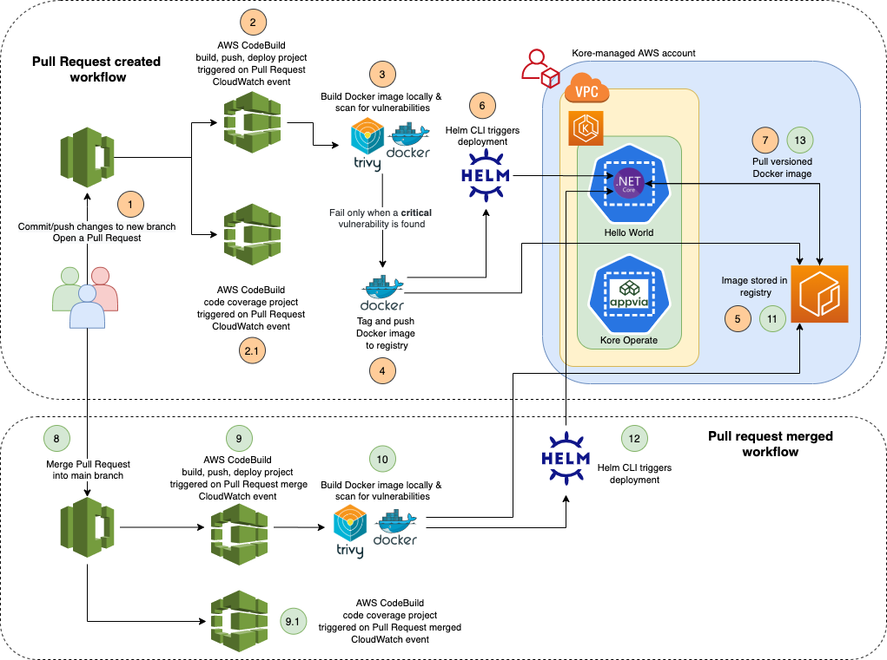

## CI with AWS services and Helm

This repository demonstrates the use of AWS services and Helm to achieve a simple continuous integration pipeline.

The CI workflow is triggered when a developer creates or merges an AWS CodeCommit pull request. This ensures that the code changes run through security and quality gates to provide a peer reviewer with the confidence and assurance to merge a pull request.

For demonstration purposes, code changes in a pull request or code changes merged into the `master` branch are eventually deployed in the same environment. However this can be customised according to your team's/organisation's branching and deployment strategy to extend to either perform a continuous delivery or continuous deployment to a Production environment.

## Prerequisites

The following scripts must be executed by an **AWS administrator** to ensure that a developer is granted least privileged permissions to complete the setup.

```bash
cd scripts
./grant-aws-access.sh -u <USER_NAME>
```

Once an **AWS administrator** has successfully executed the above scripts, you must update your local AWS configuration to obtain the required permissions.

Update `~/.aws/credentials` with an IAM user part of the `appvia-workshop-admin` IAM group.
```
[appvia-workshop-user]
aws_access_key_id = <AWS_ACCESS_KEY_ID>
aws_secret_access_key = <AWS_SECRET_ACCESS_KEY>
```

Update `~/.aws/config` to reference the above source profile and the `appvia-workshop-admin-role` IAM role to assume.
```
[profile appvia-workshop-user]
role_arn=arn:aws:iam::<AWS_ACCOUNT_ID>:role/appvia-workshop-admin-role
source_profile=appvia-workshop-user
region=eu-west-2
```

## Getting started

### Create and connect to CodeCommit repository

1. Create a new CodeCommit repository.
```bash
aws codecommit create-repository --repository-name kore-example-apps
```

1. Install the [git-remote-codecommit](https://pypi.org/project/git-remote-codecommit/) utility on your local computer to provide a simple method for pushing and pulling code from CodeCommit repositories. It extends Git by enabling the use of AWS temporary credentials.
```bash
pip install git-remote-codecommit
```

1. Clone the existing `kore-example-apps` GitHub repository and push to the new CodeCommit repository.
```bash
git clone https://github.com/appvia/kore-example-apps.git
cd kore-apps && rm -rf .github .git
git init && git remote add origin codecommit://appvia-workshop-user@kore-example-apps && \
git add . && git commit -m "initial commit" && git push -u origin master
```

#### Create CodeBuild build specifications

1. Create a build specification to instruct CodeBuild how to build, scan for vulnerabilities, package and deploy the .net core web application - see [buildspec.yml](https://github.com/appvia/kore-example-apps/blob/main/dotnet-hello-world/ci/aws/codebuild/buildspec.yml)

1. Create another build specification to instruct Codebuild how to perform static code analysis and push the report to SonarCloud - see [buildspec-sonarcloud.yml](https://github.com/appvia/kore-example-apps/blob/main/dotnet-hello-world/ci/aws/codebuild/buildspec-sonarcloud.yml)

#### Create CodeBuild projects

1. Create an IAM role that enables CodeBuild to interact with dependent AWS services on behalf of the AWS account.  
```bash
aws iam create-role --profile appvia-workshop-user --role-name CodeBuildServiceRole --assume-role-policy-document "{\"Version\":\"2012-10-17\",\"Statement\":[{\"Effect\":\"Allow\",\"Principal\":{\"Service\":\"codebuild.amazonaws.com\"},\"Action\": \"sts:AssumeRole\"}]}"
aws iam put-role-policy --profile appvia-workshop-user --role-name CodeBuildServiceRole --policy-name CodeBuildServiceRolePolicy --policy-document file://iam-codebuild-role-policy.json
```

1. Create a build project that references the CodeCommit repository and the [buildspec.yml](https://github.com/appvia/kore-example-apps/blob/main/dotnet-hello-world/ci/aws/codebuild/buildspec.yml).
```bash
AWS_ACCOUNT_ID=$(aws sts get-caller-identity --profile appvia-workshop-user --query "Account" --output text)
aws codebuild create-project \
 --profile appvia-workshop-user \
 --name dotnet-hello-world-build-deploy \
 --source "{\"type\": \"CODECOMMIT\",\"location\": \"https://git-codecommit.eu-west-2.amazonaws.com/v1/repos/kore-example-apps\", \"buildspec\": \"dotnet-hello-world/ci/aws/codebuild/buildspec.yml\"}" \
 --environment "{\"type\": \"LINUX_CONTAINER\",\"image\": \"aws/codebuild/amazonlinux2-x86_64-standard:3.0\",\"computeType\": \"BUILD_GENERAL1_SMALL\"}" \
 --service-role "arn:aws:iam::${AWS_ACCOUNT_ID}:role/CodeBuildServiceRole" \
 --artifacts "{\"type\": \"NO_ARTIFACTS\"}" \
 --source-version "refs/heads/master"
```

1. Create a build project that references the CodeCommit repository and the [buildspec-sonarcloud.yml](https://github.com/appvia/kore-example-apps/blob/main/dotnet-hello-world/ci/aws/codebuild/buildspec-sonarcloud.yml).
```bash
AWS_ACCOUNT_ID=$(aws sts get-caller-identity --profile appvia-workshop-user --query "Account" --output text)
aws codebuild create-project \
 --profile appvia-workshop-user \
 --name dotnet-hello-world-code-coverage-more \
 --source "{\"type\": \"CODECOMMIT\",\"location\": \"https://git-codecommit.eu-west-2.amazonaws.com/v1/repos/kore-example-apps\", \"buildspec\": \"dotnet-hello-world/ci/aws/codebuild/buildspec-sonarcloud.yml\"}" \
 --environment "{\"type\": \"LINUX_CONTAINER\",\"image\": \"aws/codebuild/amazonlinux2-x86_64-standard:3.0\",\"computeType\": \"BUILD_GENERAL1_SMALL\"}" \
 --service-role "arn:aws:iam::${AWS_ACCOUNT_ID}:role/CodeBuildServiceRole" \
 --artifacts "{\"type\": \"NO_ARTIFACTS\"}" \
 --source-version "refs/heads/master"
```

#### Create CloudWatch rule for CI

1. Create an IAM role that enables CloudWatch to start builds for the CodeBuild projects.
```bash
aws iam create-role --profile appvia-workshop-user --role-name CloudWatchServiceRole --assume-role-policy-document "{\"Version\":\"2012-10-17\",\"Statement\":[{\"Effect\":\"Allow\",\"Principal\":{\"Service\":\"events.amazonaws.com\"},\"Action\": \"sts:AssumeRole\"}]}"
aws iam put-role-policy --profile appvia-workshop-user --role-name CloudWatchServiceRole --policy-name CloudWatchServiceRolePolicy --policy-document file://iam-cloudwatch-role-policy.json
```

1. Create a CloudWatch rule that triggers a continuous integration workflow when a CodeCommit pull request is created and/or updated.
```bash
AWS_ACCOUNT_ID=$(aws sts get-caller-identity --profile appvia-workshop-user --query "Account" --output text)
aws events put-rule \
 --profile appvia-workshop-user \
 --name trigger-ci-workflow-on-pr \
 --event-pattern file://../cloudwatch/pr-event-pattern.json \
 --role-arn "arn:aws:iam::${AWS_ACCOUNT_ID}:role/CloudWatchServiceRole"
```

1. Create a CloudWatch rule that triggers a deployment workflow when a CodeCommit pull request is merged into the `master` branch.


#### Create Kubernetes service account for CI/CD

#### Create SonarCloud project
<!-- A SonarCloud token with access to a new or existing SonarCloud project -->

## Triggering the CI pipeline

https://docs.aws.amazon.com/codecommit/latest/userguide/setting-up-git-remote-codecommit.html
