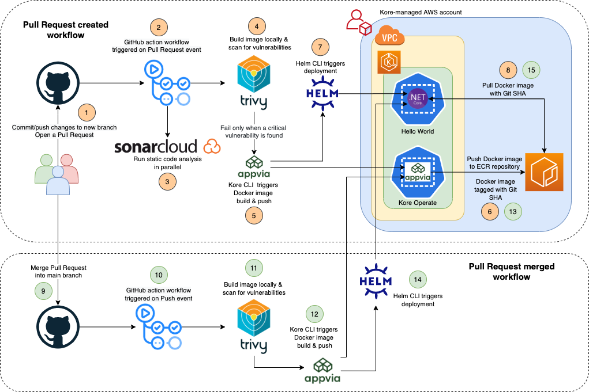

## CI with GitHub Actions, Kore and Helm

This repository demonstrates the use of GitHub Actions, Kore and Helm to achieve a simple continuous integration pipeline.

The CI workflow is triggered when a developer creates or merges a GitHub pull request. This ensures that the code changes run through security and quality gates to provide a peer reviewer with the confidence and assurance to merge a pull request.

For demonstration purposes, code changes in a `pull request` or code changes merged into the `master` branch are eventually deployed in the same environment. However this can be customised according to your team's/organisation's branching and deployment strategy to extend to either perform a continuous delivery or continuous deployment to a Production environment.

## Getting started

### Create GitHub Actions workflow

The GitHub Actions workflow has been created under `.github/workflows/dotnet-hello-world.yml`. Refer to the [Github Actions Documentation](https://docs.github.com/en/free-pro-team@latest/actions) if you wish to customise the existing workflow or create a new one.

#### Create GitHub Actions Secrets

Add the following as Actions secrets in the repository.
```
HELM_KUBEAPISERVER # The Kubernetes API Server URL
HELM_KUBETOKEN     # The Kubernetes Service Account token
HELM_NAMESPACE     # The Kubernetes namespace
EKS_CLUSTER_CA     # The Kubernetes cluster certificate authority (Only applies to AWS EKS)
SONAR_TOKEN        # The SonarCloud token
KORE_TEAM          # The Kore-managed team
KORE_SERVER        # The Kore API Server URL
DOTNET_KORE_TOKEN  # The Kore Service Account token
```


## Triggering the CI pipeline

You can now start making code changes and trigger the `pull request` and `pull request merged` workflows as demonstrated in the diagram below.  



## Access Web application

https://hello.gh-actions-workshop.teams.demo.kore.appvia.io
